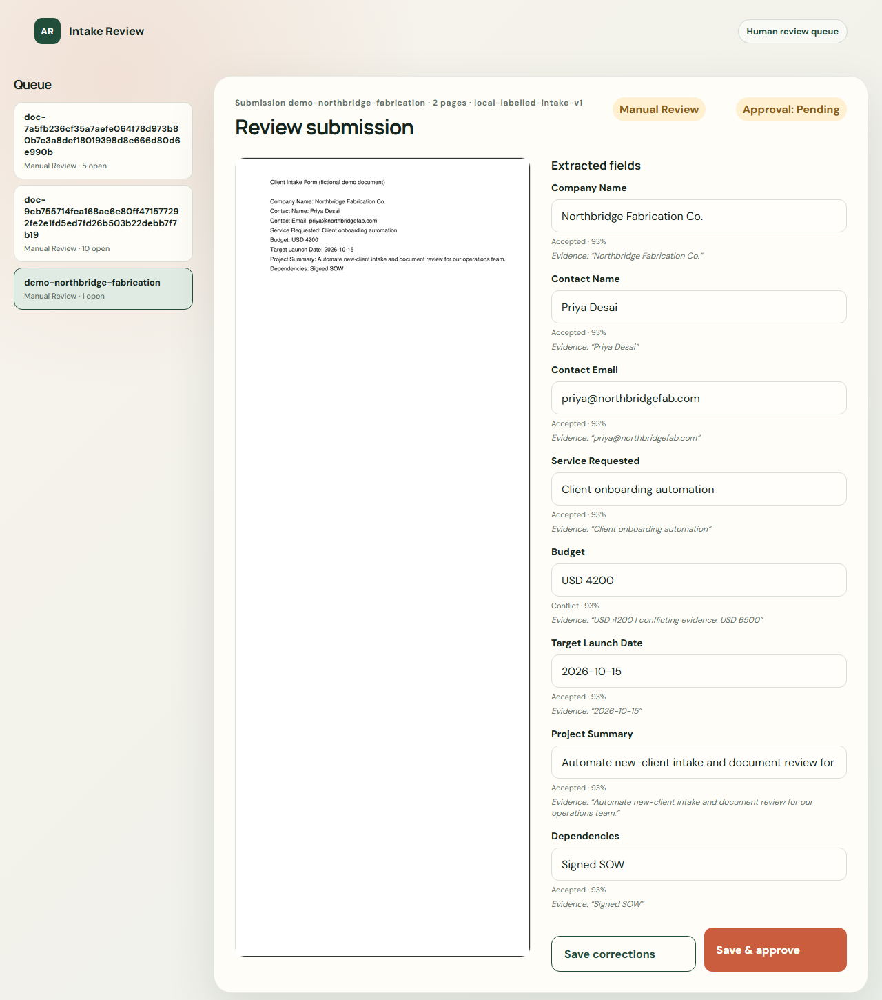
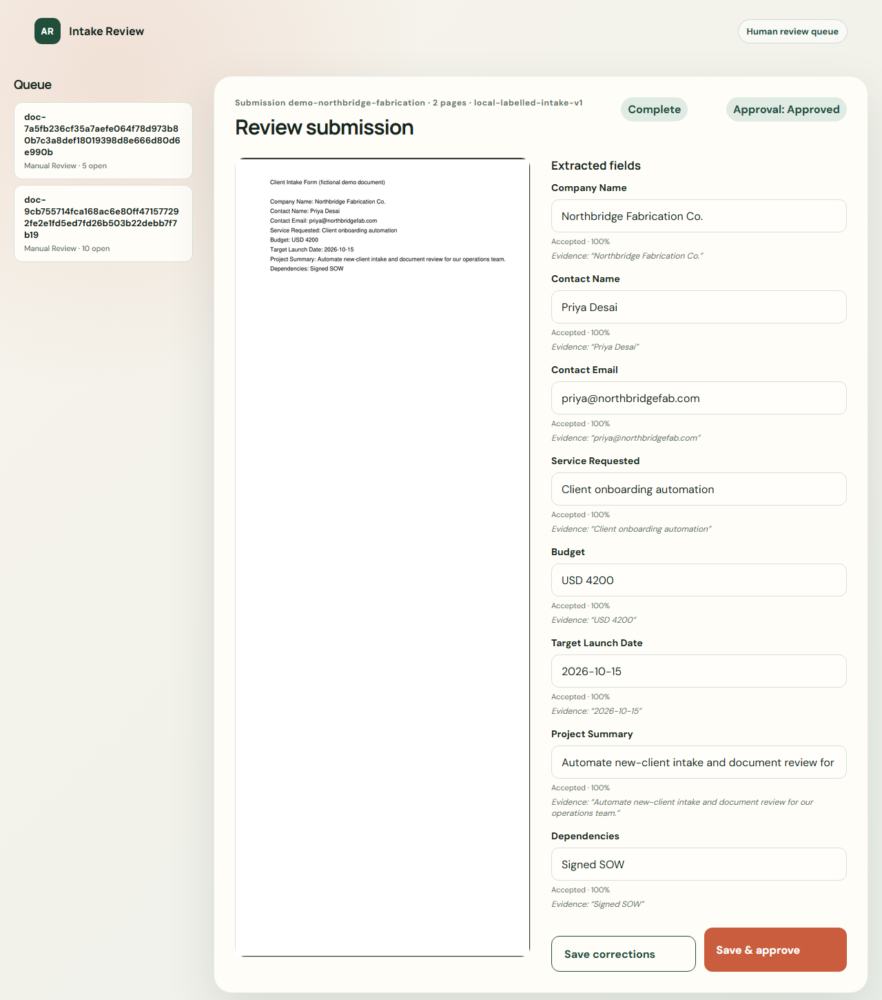

# AI Client Onboarding & Document Review

**81.67% field accuracy across 60 real, independently-labelled receipts** (public ICDAR2019 SROIE dataset, live `gemini-3.6-flash`, no cherry-picking) — company 81.67%, date 91.67%, address 55.0%, total 98.33%. That's a different document schema than the shipped intake form below (receipts vs. agency intake forms); it's an isolated proof that the extraction *approach* holds up on genuinely messy real documents, not the intake-form number itself. See [Real receipts](#real-receipts--a-different-schema-run-as-isolated-proof) for full methodology and the honest scope note.

The human review queue in action — a document with a genuinely conflicting field (the same demo form states two different budgets across its two pages) gets flagged instead of silently resolved, then corrected and approved:

| Flagged for review | Corrected and approved |
|---|---|
|  |  |

Real screenshots of the running app, not mockups — same fictional demo document used throughout this README.

Standalone hardening of the existing service demo: **English agency intake forms only**, preserving the original eight fields and adding service-table rows (`description`, `quantity`, `unitPrice`). No SaaS, accounts, billing, or automatic communication.

Upload → page text → structured extraction → OCR fallback → field review → durable audit/result → optional Google Sheets outbox.

The existing `/api/onboarding` form now uses this local pipeline. The legacy n8n export is preserved and is not called. No live n8n workflow, Aarambh system, or shared Sheet was changed.

## What changed

- All PDF pages are processed, including mixed digital/scanned pages. Table rows retain order and duplicates; unreadable cells and ambiguous tables enter review.
- Local RapidOCR fallback runs on images, failed/weak page text, low-confidence fields and incomplete tables.
- Model timeout, rate-limit and malformed-response retries use bounded exponential backoff. SHA-256 deduplication and submission-ID aliases persist in H2 across restarts. Explicit reprocessing updates the same record and retains earlier attempts.
- Partial results survive page/field failures. Each field records value, confidence/source, status, evidence and page numbers. Conflicts or scores below `0.85` route to `MANUAL_REVIEW`; genuine absence routes to `MISSING_INFORMATION`.
- Extraction attempts and final results are audited. Optional Sheets delivery uses durable, fixed row assignments and `RAW` updates, never append. Failed delivery remains pending.
- The accuracy harness measures per-field, full-document and routing accuracy, plus accepted-field precision/coverage. Failed documents and extra table rows count against the score.

## Run locally

PowerShell, from this folder. Requires Java 21, Maven and Python 3.12. OCR installs inside this project on D:.

```powershell
python -m pip install --upgrade --target .runtime/python --cache-dir .runtime/pip-cache -r scripts/ocr-requirements.txt
& 'D:\Programs\Maven\apache-maven-3.9.16\bin\mvn.cmd' verify
python -m unittest discover -s scripts -p test_accuracy.py -v
java -jar target/ai-client-onboarding-review-0.0.1-SNAPSHOT.jar
```

Open `http://127.0.0.1:8091`. Default provider `local` is a **labelled-form rules baseline**, not Gemini and not an AI accuracy claim. It needs no credentials and sends no documents externally. Its scores are rule heuristics.

For AI extraction, set `EXTRACTION_PROVIDER=gemini`, `EXTRACTION_GEMINI_API_KEY` through your runtime secret store, and optionally `EXTRACTION_GEMINI_MODEL` (default `gemini-3.6-flash`) before starting. Only this explicitly selected mode sends page text/OCR text to Gemini. Model scores are self-reports, not calibrated probabilities. Gemini transport has local HTTP contract tests and was exercised against the live API with a demo key on the synthetic corpus (93.18% field accuracy, `output/accuracy/synthetic-gemini.json`); real-document accuracy is still unmeasured. The OCR fallback path calls the model twice per page, so real volume needs a paid Gemini quota tier — the free tier rate-limits under batch load. `.env.example` lists configuration names; Spring does not automatically load `.env` files.

## Accuracy test when you add real documents

1. Put your sample PDF/PNG/JPEG intake forms in `samples/private/documents/`.
2. Copy `samples/answer-key.example.json` to `samples/private/answer-key.json`. Independently label every document: all eight fields, `null` for absent values, all ordered line-item rows (or `[]`) and expected routing. Do not generate the key from model output.
3. Start the server in the provider mode being evaluated, then run:

```powershell
python scripts/accuracy.py --samples samples/private/documents --key samples/private/answer-key.json --expect-provider gemini/gemini-3.6-flash --output output/accuracy/real-intake.json
```

For a local baseline, replace the expected provider with `local-labelled-intake-v1`. The harness forces fresh extraction into the same canonical record/Sheet row. Use a standalone benchmark store, not one bound to a live Sheet. JSON contains each mismatch and confidence; the adjacent Markdown contains the summary. Empty datasets, unlabelled files and duplicate document bytes are rejected. Free-text scoring is normalized exact match, not semantic similarity; table row order matters.

Reproduce the fictional benchmark after `mvn verify`:

```powershell
python scripts/accuracy.py --samples target/accuracy-fixtures --key target/accuracy-answer-key.json --expect-provider local-labelled-intake-v1 --output output/accuracy/synthetic-local.json
```

**Real-document accuracy for this shipped intake-form schema is not yet measured** — see below for the separate, already-closed real-receipts proof on a different schema. Synthetic fixtures establish mechanics; the local baseline and Sheets outbox are mock/rule-tested, and Gemini has one live run on synthetic intake-form data (93.18% field accuracy), not real intake-form accuracy or live-provider readiness. Use independently labelled real intake forms before making a paid accuracy claim on this specific schema.

### Real receipts — a different schema, run as isolated proof

60 real, independently-labelled receipts (public ICDAR2019 SROIE dataset, CC-BY-4.0) were run against a separate, isolated receipt schema (`company`/`date`/`address`/`total`) — a different document type than the shipped intake form, built as a standalone add-on that never touches `IntakeSchema` or the production pipeline:

```powershell
python scripts/accuracy_receipts.py --images test-data/real-receipts-sroie/images --key test-data/real-receipts-sroie/answer-key.json
```

Result: **81.67% field accuracy across all 60 receipts** (company 81.67%, date 91.67%, address 55.0%, total 98.33%) on live `gemini-3.6-flash`, no cherry-picking. Report: `output/accuracy/real-receipts-sroie.json` (git-ignored, like all real document data). Roughly half of the "address" misses are strict-match scoring penalizing punctuation/formatting differences on an otherwise-correct read, not real extraction failures.

**This proves the extraction approach holds up on real, messy documents. It does not replace the intake-form number above** — never blend the two into one unqualified "accuracy" claim.

## Review, audit and optional Sheets

- `POST /api/extractions`: multipart `document`, optional `submissionId`; `?reprocess=true` reruns extraction into the same record.
- `GET /api/extractions/{id}` and `/{id}/audit`: full structured result and attempt history.
- `GET /api/extractions/{id}/document`: original file bytes for a submission (only for submissions processed after this was added — earlier records have no stored bytes).
- `POST /api/extractions/{id}/review`: apply human corrections to fields/line items and, optionally, approve.
- `GET /api/extractions/review-queue`: persisted documents with the exact field/cell paths needing review — `/review.html` renders this as a side-by-side document/fields UI for correcting and approving.
- `GET /api/extractions/pending-sheet`, `POST /api/extractions/sync-sheet`: inspect/drain the durable outbox. Sync is disabled until explicitly configured.

See [operating details](docs/extraction.md) for Sheet setup, confidence rules, limits, recovery and test evidence. Runtime data, OCR dependencies, private samples and accuracy reports are git-ignored. Keep the H2 store: deleting it loses deduplication history and Sheet row ownership.
